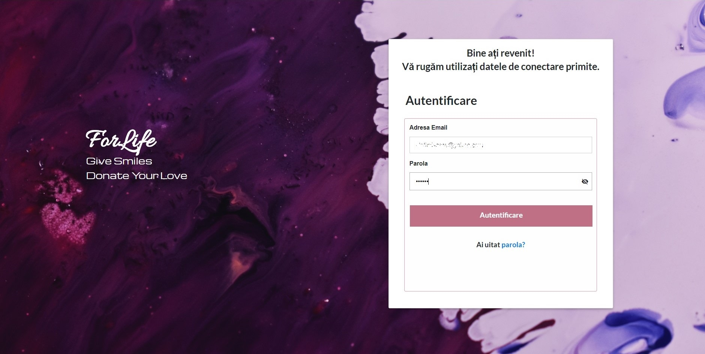

# blood-management-web-app
Web application for management of blood donations 

Short description:
the web application, dedicated to blood transfusion centers, has as main role the administration of reservations from the mobile application. In addition to this role, the application offers the possibility for doctors to make reservations in turn, so that when people go to donate, the reservations do not overlap and each one enters the scheduled time interval. Doctors can cancel reservations if the users can no longer honored them, freeing up space for someone else who could donate during that time. The app also provides real-time statistics on the number of donors in the country, by county and gender. At the same time, doctors have the opportunity to add and manage emergencies that occur, donors being notified about these emergencies through the notifications they receive in the mobile application.

<figure>
  <figcaption><strong>Fig.1 - Authentication Page.</strong></figcaption>
    
</figure>

The application was developed using JavaScript, HTML5 and CSS3. 
For more details or for a video demonstration, you can write me.
Also, you can find more pictures in the images folder.
